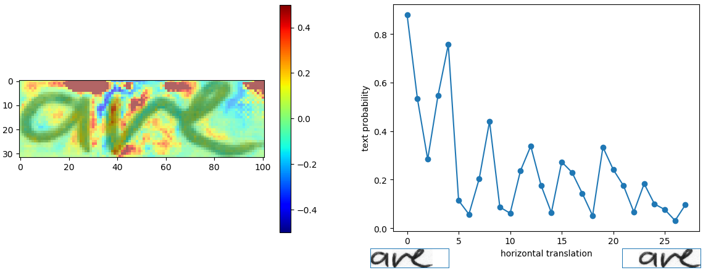

# Handwritten Text Recognition with a Neuronal Network

**Project 2A Ensisa (2018-2019):**

Handwritten Text Recognition (HTR) system implemented with `Tensorflow, OpenCV, Keras...` and trained on the IAM off-line HTR dataset.


### Acknowledgements
A big thank-you to **Mr. Michel HASSENFORDER** (Teacher at ENSISA Mulhouse France) for his supervisory and his precious advice during all the realization of this project. Thank-you to [**@Harald Scheidl**](https://github.com/githubharald) for his work we used and adapted it 

#### authors:
* Melchior OBAME OBAME 
* Saad BENDAOUD

**Note:** In the entire project, `user_name` refers to the real name of a user.

## Run demo

1. Go to the `model/` unzip `model.zip` (pre-trained model on IAM dataset)
Attention: All files contained must be placed directly into the `model/` directory and **not** in some subdirectory created by the unzip-program. And in the event of a created user put the files in `model/user_name` where `user_name` is the name of the user. 

2. Go to `src/` and run `python main.py`. Here is a test image and the expected result.


```
> python main.py
Validation character error rate of saved model: 10.624916%
Init with stored values from  ../model/snapshot-38
Recognized: "little"
Probability: 0.96625507
```
tested with:
* Python 2 and Python 3 and python 3.6.8
* TF 1.3, 1.10 and 1.12 (**requirements.txt**)
* Ubuntu 16.04 ,17.04   and Windows 7,10

## Arguments for main.py : operations(train, validation, infer...)
* `--train`: train the NN, details see below.
* `--validate`: validate the NN, details see below.
* `--beamsearch`: use vanilla beam search decoding (better, but slower) instead of best path decoding.
* `--wordbeamsearch`: use word beam search decoding (only outputs words contained in a dictionary) instead of best path decoding. This is a custom TF operation and must be compiled from source, more information sees corresponding section below. It should **not** be used when training the NN.

* **Added arguments**
* `--user` or just `-u`: selection of the user you will use to apply actions (e.g.: `python main.py --user Dupont`), if not defined the actions will be applied on the user by default which is the general
* `--dump`: dumps the output of the NN to CSV file(s)
* `--segmentation` or just `-s`:  segmentation of words contained on the image (for example a short sentence). The words segmented are saved in the folder `data/user_name/outSegmentation/` (if a user is defined) or just `data/outSegmentation/` by default.

## Arguments for users.py: users management
If no user is used, the following actions are applied on the general: train, validation, infer ...
* `--addUser` (-a): add a new user (ex: `python users.py --addUser Dupond`).
* `--removeUser` (-r): remove a user (ex: `python users.py --removeUser Dupond`). 
* `--removeAllUsers` (-ra): remove all users (ex: `python users.py -ra`). 
* `--printUsers` (-pu): show all users created.
* `--formated`: format model of a user 
* `--user` (-u): select a user for example if it is to format his model (ex: `python users.py -u --formatted`).

## Location of files in the event of adding one user ##
let **user_name** the user name.
When a new user is added, his name is added to the file `model/userList.txt`.
His data are saved in `data/user_name` and his model in `model/user_name`.
The model of this newly created user is already trained (if of cours the general was already trained). Do not put the option --formatted if the user is already trained (e.g.: `python users.py -a Dupond --formatted) 

If neither `--train` nor `--validate` is specified, the NN infers the text from the test image (`data/user_name/test.png` for a user or just `data/test.png` for the default user).

Two examples: if you want to infer using beam search, execute `python main.py --beamsearch`, while you have to execute `python main.py --train --beamsearch` if you want to train the NN and do the validation using beam search.


## Integrate word beam search decoding (Only on a Linux environment)##
Besides the two decoders shipped with TF, it is possible to use word beam search decoding \[4\].
Using this decoder, words are constrained to those contained in a **dictionary**, but arbitrary non-word character strings (numbers, punctuation marks) can still be recognized.
The following illustration shows a sample for which word beam search is able to recognize the correct text, while the other decoders fail.


Instruction to follow to add word beam search:

1. Clone repository [CTCWordBeamSearch](https://github.com/githubharald/CTCWordBeamSearch).
2. Compile custom TF operation (follow instructions given in README).  (on a Linux environment only)
3. Copy binary `TFWordBeamSearch.so` from the CTCWordBeamSearch repository to the `src/` directory of the SimpleHTR repository.

Word beam search can now be enabled by setting the corresponding command line argument.
The dictionary is created (in training and validation mode) by using all words contained in the IAM dataset (i.e. also including words from validation set) and is saved into the file `data/corpus.txt`.
Further, the (manually created) list of word-characters can be found in the file `model/wordCharList.txt` or `model/user_name/wordCharList.txt` if it is use by a user.
Beam width is set to 50 to conform with the beam width of vanilla beam search decoding.


Using this configuration, a character error rate of 8% and a word accuracy of 84% is achieved.

## Model training

### IAM dataset

The data-loader expects the IAM dataset \[5\] (or any other dataset that is compatible with it) in the `data/` directory.
Follow these instructions to get the dataset:

1. Register for free at this [website](http://www.fki.inf.unibe.ch/databases/iam-handwriting-database).
2. Download `words/words.tgz`.
3. Download `ascii/words.txt` (his format **a0-000-00-01 ok X X X X X X X a** must be changed by **a0-000-00-01 a**)
4. Put `words.txt` into the `data/` directory.
5. Create the directory `data/words/`.
6. Put the content (directories `a01`, `a02`, ...) of `words.tgz` into `data/words/`.
7. convert and change structure of `words.txt` to the JSON format with the new structure with `src/data/convertToJSON.py`
**warning**:
 Format of Your `words.json` :
```
{
img1: "hello"
    ...
imgX: "good"
}
```
 With each key is the path like in words.txt (first column) and each value is the ground truth label for that image, this code will work fine.

8. Go to `data/` and run `python checkDirs.py` for a rough check if everything is ok.

If you want to train the model from scratch, delete the files contained in the `model/` directory or for a user run `python users.py -u user_Name --formated and then run the trainning`
Otherwise, the parameters are loaded from the last model-snapshot before training begins.
Then, go to the `src/` directory and execute `python main.py --train` or `python main.py --train --user user_Name` to do training with a user.
After each epoch of training, validation is done on a validation set (the dataset is split into 95% of the samples used for training and 5% for validation as defined in the class `DataLoader`).
If you only want to do validation given a trained NN, execute `python main.py --validate` or `python main.py --user user_Name --validate`.
Training on the CPU takes 18 hours on my system (VM, Ubuntu 16.04, 8GB of RAM and 4 cores running at 3.9GHz).
The expected output is shown below.

```
> python main.py --train
Init with new values
Epoch: 1
Train NN
Batch: 1 / 500 Loss: 130.354
Batch: 2 / 500 Loss: 66.6619
Batch: 3 / 500 Loss: 36.0154
Batch: 4 / 500 Loss: 24.5898
Batch: 5 / 500 Loss: 20.1845
...

Validate NN
Batch: 1 / 115
Ground truth -> Recognized
[OK] "," -> ","
[ERR:1] "Di" -> "D"
[OK] "," -> ","
[OK] """ -> """
[OK] "he" -> "he"
[OK] "told" -> "told"
[ERR:2] "her" -> "nor"
...
Character error rate: 13.956289%. Word accuracy: 67.721739%.
```

### Other Dataset

Either convert your dataset to the IAM format (look at `words.txt` and the corresponding directory structure) or change the class `DataLoader` according to your dataset format.

## Generating a more larger data set
By merging the images from the data set [**MNIST**](http://yann.lecun.com/exdb/mnist/train-images-idx3-ubyte.gz)(you have to make sure that the file structure is respected) with the ones from **IAM**.
It is possible to download fonts with a hand-written style, apply them on the alphabetic characters and special characters and save each character on separated images you will add to your main data set.  

## Data Augmentation
The Data augmentation increases dataset-size by applying further (random) transformations to the input images. 95% of the images are dedicated to the training and 5% to the validation.
The images created by the data augmentation are not saved on the computer but generated during the loading of the images for the neuronal network. This way we can save memory on the disk.

### Architecture of the neuronal network (model)
The model \[1\] is a stripped-down version of the HTR system I implemented for my thesis \[2\]\[3\].
What remains is what I think is the bare minimum to recognize text with an acceptable accuracy.
The implementation only depends on numpy, cv2 and tensorflow imports.
It consists of 5 CNN layers, 2 RNN (LSTM) layers and the CTC loss and decoding layer.
The illustration below gives an overview of the NN (green: operations, pink: data flowing through NN) and here follows a short description:

* The input image is a gray-value image and has a size of 128x32
* 5 CNN layers map the input image to a feature sequence of size 32x256
* 2 LSTM layers with 256 units propagate information through the sequence and map the sequence to a matrix of size 32x80. Each matrix-element represents a score for one of the 80 characters at one of the 32 time-steps
* The CTC layer either calculates the loss value given the matrix and the ground-truth text (when training), or it decodes the matrix to the final text with best path decoding or beam search decoding (when inferring)
* Batch size is set to 50


### Improve accuracy

74% of the words from the IAM dataset are correctly recognized by the NN when using vanilla beam search decoding.
If you need a better accuracy, here are some ideas how to improve it \[2\]:

* Data augmentation: increase dataset-size by applying further (random) transformations to the input images. At the moment, only random distortions are performed.
* Add more CNN layers.
* Replace LSTM by 2D-LSTM.
* Text correction: if the recognized word is not contained in a dictionary, search for the most similar one.

### Analyze model

Run `python analyze.py` with the following arguments to analyze the image file `data/analyze.png` with the ground-truth text "are":

* `--relevance`: compute the pixel relevance for the correct prediction.
* `--invariance`: check if the model is invariant to horizontal translations of the text.
* No argument provided: show the results.

Results are shown in the plots below.
The pixel relevance (left) shows how a pixel influences the score for the correct class.
Red pixels vote for the correct class, while blue pixels vote against the correct class.
It can be seen that the white space above vertical lines in images is important for the classifier to decide against the "i" character with its superscript dot.
Draw a dot above the "a" (red region in plot) and you will get "aive" instead of "are".

The second plot (right) shows how the probability of the ground-truth text changes when the text is shifted to the right.
As can be seen, the model is not translation invariant, as all training images from IAM are left-aligned.
Adding data augmentation which uses random text-alignments can improve the translation invariance of the model.
More information can be found in [this article] (https://towardsdatascience.com/6c04864b8a98).




## FAQ

1. I get the error message "Exception: No saved model found in: ... ": unzip the file `model/model.zip`. All files contained must be placed directly into the `model/` directory and **not** in some subdirectory created by the unzip-program.
2. I get the error message "... TFWordBeamSearch.so: cannot open shared object file: No such file or directory": if you want to use word beam search decoding, you have to compile the custom TF operation from source.
3. I get the error message "... ModuleNotFoundError: No module named 'editdistance'": you have to install the mentioned module by executing `pip install editdistance`.
4. Where can I find the file `words.txt` of the IAM dataset: it is located in the subfolder `ascii` of the IAM website and convert it to JSON white `data/convertToJSON.py`.
5. I use a custom image of handwritten text, but the NN outputs a wrong result: the NN is trained on the IAM dataset. The NN not only learns to recognize text, but it also learns properties of the dataset-images. Some obvious properties of the IAM dataset are: text is tightly cropped, contrast is very high, most of the characters are lower-case. Either you preprocess your image to look like an IAM image, or you train the NN on your own dataset. See [this article](https://medium.com/@harald_scheidl/27648fb18519).
6. I get an error when running the script more than once from an interactive Python session: do **not** call function `main()` in file `main.py` from an interactive session, as the TF computation graph is created multiple times when calling `main()` multiple times. Run the script by executing `python main.py` instead.


## References

\[1\] [Build a Handwritten Text Recognition System using TensorFlow](https://towardsdatascience.com/2326a3487cd5)

\[2\] [Scheidl - Handwritten Text Recognition in Historical Documents](https://repositum.tuwien.ac.at/obvutwhs/download/pdf/2874742)

\[3\] [Scheidl - Word Beam Search: A Connectionist Temporal Classification Decoding Algorithm](https://repositum.tuwien.ac.at/obvutwoa/download/pdf/2774578)

\[4\] [Marti - The IAM-database: an English sentence database for offline handwriting recognition](http://www.fki.inf.unibe.ch/databases/iam-handwriting-database)
